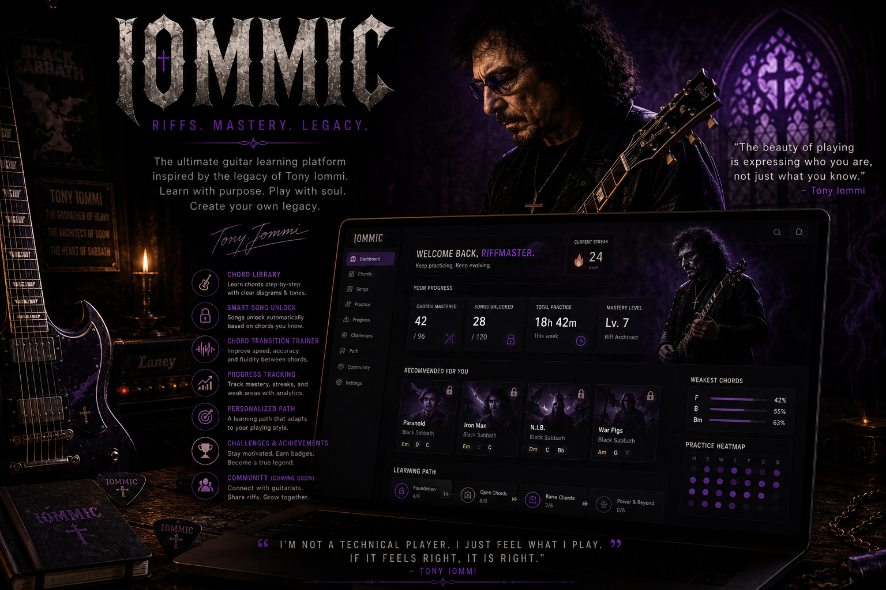

<div align="center">
  

  <br />
  <br />

  <h2><b>L E A R N &nbsp; W I T H &nbsp; P U R P O S E. &nbsp; P L A Y &nbsp; W I T H &nbsp; S O U L. &nbsp; C R E A T E &nbsp; Y O U R &nbsp; O W N &nbsp; L E G A C Y.</b></h2>
  
  <p>
    <i>An atmospheric guitar-learning ecosystem inspired by the undisputed master of the heavy riff.</i>
  </p>

  <br />

[](#)
[](#)
[](#)
[](#)
[](#)

</div>

<hr style="border: 1px solid #1a1a1a;" />

## THE LEGACY

Tony Iommi didn't just play the guitar; he built a new sound through adversity. When two of his fingertips were severed, he tuned down, turned up the gain, and pioneered heavy metal. IOMMIC is built on that same relentless ethos. It is not about perfect theory or sterile exercises—it is about tone, weight, and steady progression. It is a tribute to the architects of heavy music and a platform for the next generation of players.

<hr style="border: 1px solid #1a1a1a;" />

## PHILOSOPHY

IOMMIC is built around progression over instant gratification. Real musicianship takes time, and this platform was designed to reflect that reality.

- Songs and advanced techniques are unlocked gradually.
- Mastery matters more than content overload.
- Repetition and discipline are core ideas.
- Learning guitar should feel meaningful and immersive.

<hr style="border: 1px solid #1a1a1a;" />

## WHY I BUILT THIS

The digital landscape is cluttered with brightly colored, overly gamified guitar tutorials that often lack soul. I wanted an environment that felt like stepping into a dedicated rehearsal space. A platform that doesn't hand you everything at once, but demands mastery before revealing its next chapter. I built IOMMIC because the journey of learning the guitar should feel as legendary, atmospheric, and heavy as the music itself.

<hr style="border: 1px solid #1a1a1a;" />

## HOW IOMMIC WORKS

The learning experience is structured to build real skill, ensuring you never feel lost or overwhelmed:

1. **Learn Foundational Chords:** Start with the bedrock of heavy rhythm.
2. **Practice Transitions and Rhythm:** Master the spaces between the notes.
3. **Build Mastery Through Repetition:** Lock in muscle memory with focused practice routines.
4. **Unlock Songs Dynamically:** Gain access to new tracks only after proving your foundational competence.
5. **Track Progress and Streaks:** Consistency is visualized to keep your momentum going.
6. **Progress Toward Advanced Material:** Continuously push the boundaries of your playing ability.

<hr style="border: 1px solid #1a1a1a;" />

## PREVIEW

### Dashboard


### Chord System


### Practice Tracking


### Song Unlock System


<hr style="border: 1px solid #1a1a1a;" />

## FEATURES

| Feature                         | Description                                                               |
| :------------------------------ | :------------------------------------------------------------------------ |
| **Smart Song Unlock System**    | Progressively unlock new songs as your technical proficiency grows.       |
| **Chord Mastery Tracking**      | Granular analytics on chord resonance, sustain, and accuracy.             |
| **Personalized Learning Paths** | A curriculum adapting to your unique playing style and weaknesses.        |
| **Chord Transition Trainer**    | Isolate and master difficult chord changes to improve fluidity.           |
| **Practice Heatmaps**           | Track your practice consistency through daily heatmaps.                   |
| **Streak System**               | Build unbroken chains of daily practice. Momentum is your greatest asset. |
| **Guitar Progress Analytics**   | Deep insights mapping your journey from beginner to confident guitarist.  |
| **Dynamic Recommendations**     | Exercises curated to push you to the edge of your current ability.        |

<hr style="border: 1px solid #1a1a1a;" />

## ARCHITECTURE & TECH STACK

IOMMIC is built on a foundation of modern, battle-tested technologies to create a seamless, low-latency experience.

- **Frontend:** Next.js & React for a reactive, server-rendered interface.
- **Styling:** Tailwind CSS, utilizing a dark, minimal, and premium aesthetic.
- **State Management:** Zustand, providing predictable, lightweight state management.
- **Authentication:** Clerk Authentication, securing your progression seamlessly.
- **Database:** MongoDB & Mongoose, a scalable database layer for progression, analytics, and unlocked content.
- **Audio Processing:** Web Audio API & Pitchy, performing real-time, low-latency pitch detection to analyze your playing.

<hr style="border: 1px solid #1a1a1a;" />

## PROJECT STRUCTURE

```text
iommic/
├── app/                  # Next.js App Router
│   ├── globals.css       # Core styling and Tailwind directives
│   ├── layout.tsx        # Master layout and font configurations
│   └── page.tsx          # Application entry point
├── components/           # Reusable UI components
├── lib/                  # Database connections and abstractions
├── store/                # Zustand state management
├── utils/                # Audio analysis algorithms
└── public/               # Static assets and placeholders
```

<hr style="border: 1px solid #1a1a1a;" />

## SETUP & INSTALLATION

Prepare your local environment.

1. **Clone the repository**

   ```bash
   git clone https://github.com/your-username/iommic.git
   cd iommic
   ```

2. **Install dependencies**

   ```bash
   npm install
   ```

3. **Configure your environment**
   Copy the example environment file.

   ```bash
   cp .env.example .env.local
   ```

4. **Start the development server**
   ```bash
   npm run dev
   ```
   Open `http://localhost:3000` to start the application.

<hr style="border: 1px solid #1a1a1a;" />

## ENVIRONMENT VARIABLES

To run IOMMIC locally, you will need to configure the following secrets in your `.env.local` file:

```env
NEXT_PUBLIC_CLERK_PUBLISHABLE_KEY=
CLERK_SECRET_KEY=
MONGODB_URI=
```

<hr style="border: 1px solid #1a1a1a;" />

## DEPLOYMENT

The recommended deployment path is through Vercel.

1. Push your code to a GitHub repository.
2. Import the project into Vercel.
3. Inject the environmental secrets into the Vercel dashboard.
4. Deploy to production.

<hr style="border: 1px solid #1a1a1a;" />

## ROADMAP

- **Phase I:** Core audio detection, chord tracking, and dark-themed UI.
- **Phase II:** Implementation of the Smart Unlock System and personalized learning paths.
- **Phase III:** Multiplayer riff-sharing, leaderboards, and collaborative transition training.
- **Phase IV:** Advanced tone analysis (distortion and fuzz response detection).

<hr style="border: 1px solid #1a1a1a;" />

## CONTRIBUTING

Contributions are welcome to help improve the platform.

1. Fork the repository.
2. Create your feature branch (`git checkout -b feature/new-component`).
3. Commit your changes (`git commit -m 'Add new component'`).
4. Push to the branch (`git push origin feature/new-component`).
5. Open a Pull Request.

Ensure your code is clean, your logic is robust, and your aesthetic matches the premium standard of the platform.

<hr style="border: 1px solid #1a1a1a;" />

## FUTURE VISION

IOMMIC will evolve from a learning platform into a modern digital sanctuary for heavy music creation. The vision entails integrating tone generation, allowing users to not just learn riffs, but to sculpt their digital amp settings directly in the browser, matching the colossal sound of their heroes.
